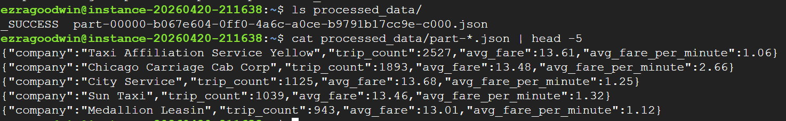

# HW4

## Part 2.1 — PySpark Preprocessing Screenshot

The screenshot shows the `processed_data/` folder containing the `_SUCCESS` file
and a `part-*.json` file. Sample output line:
{"company":"Yellow Cab","trip_count":3021,"avg_fare":14.30,"avg_fare_per_minute":1.05}
